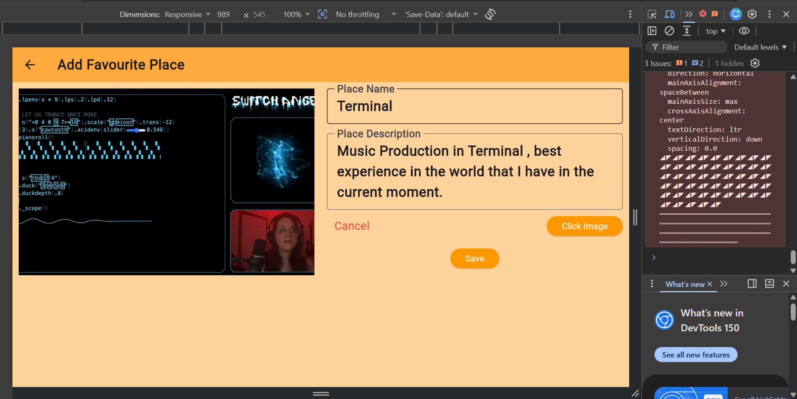
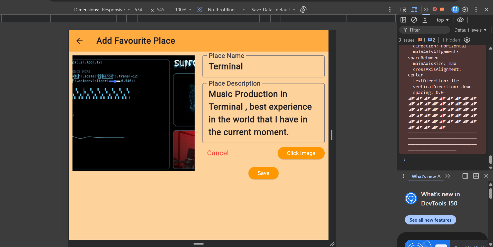
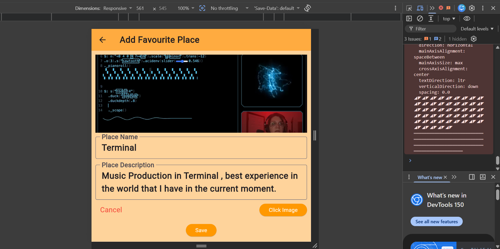
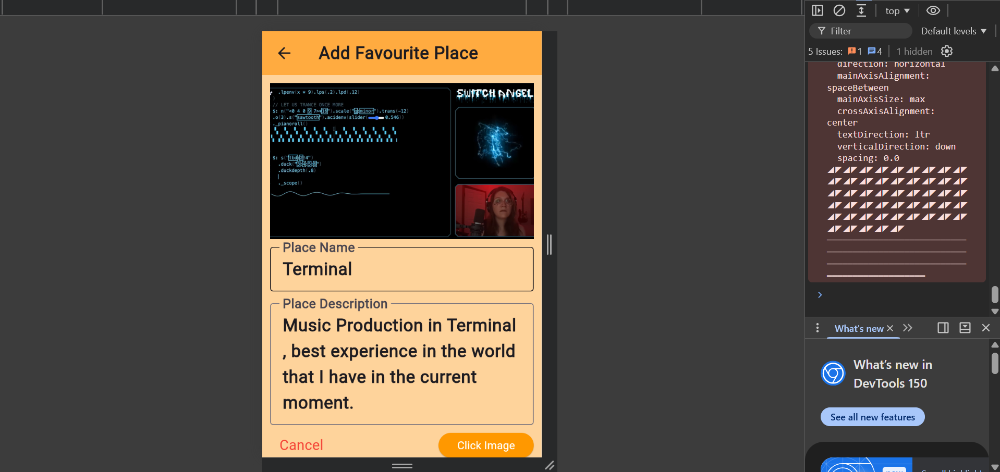
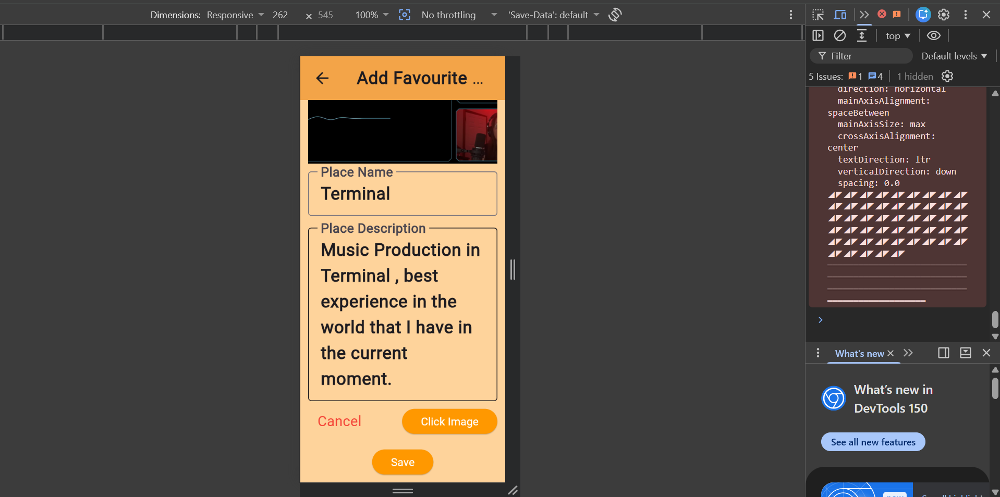
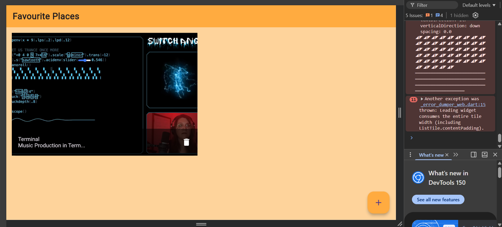
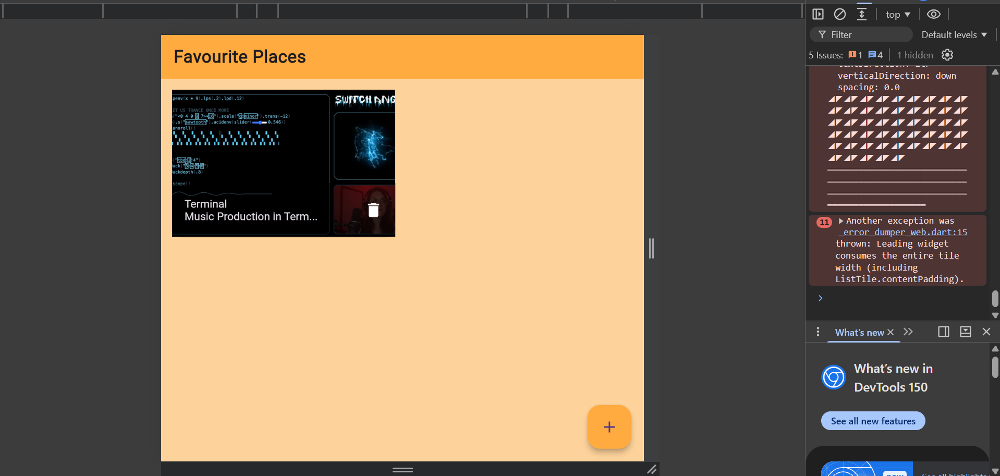
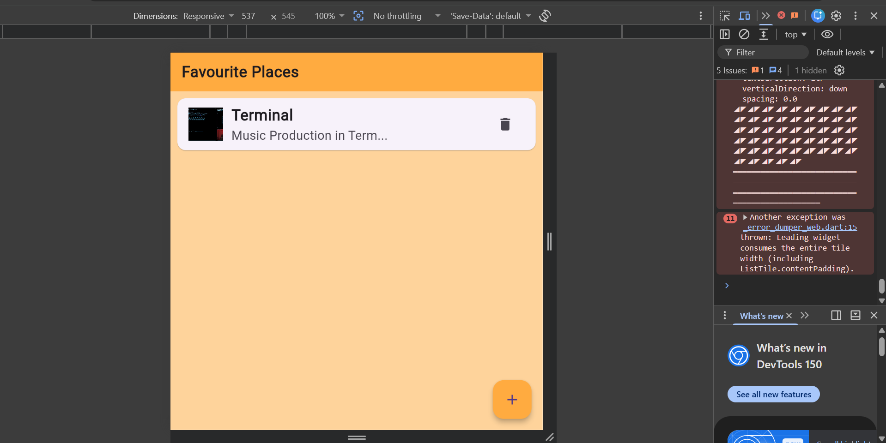

# assingment12

## Create a Flutter application that works well on:
- Mobile phones
- Tablets
- Larger screens (if available)

## Implement responsive design using:
- MediaQuery
- LayoutBuilder

## Implement adaptive behavior:
- Layout changes based on screen size or orientation

## Ensure Ul elements scale properly without overflow.

## Test the app on different screen sizes or emulators.

## Screenshots

