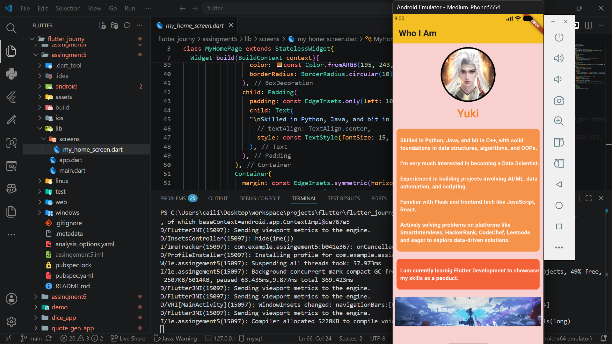

# Assingement5

## Create a Flutter screen using basic Ul widgets, such as:
- Scaffold
- AppBar
- Text
- Container
- RowandColumn

## Design a simple layout that includes:
- Title text
- Icons or images
- Proper spacing and alignment

## Apply basic styling:
- Colors
- Padding and margin
- Font size and weight

### Ensure the Ul adapts correctly to different screen sizes.

## Screenshots
