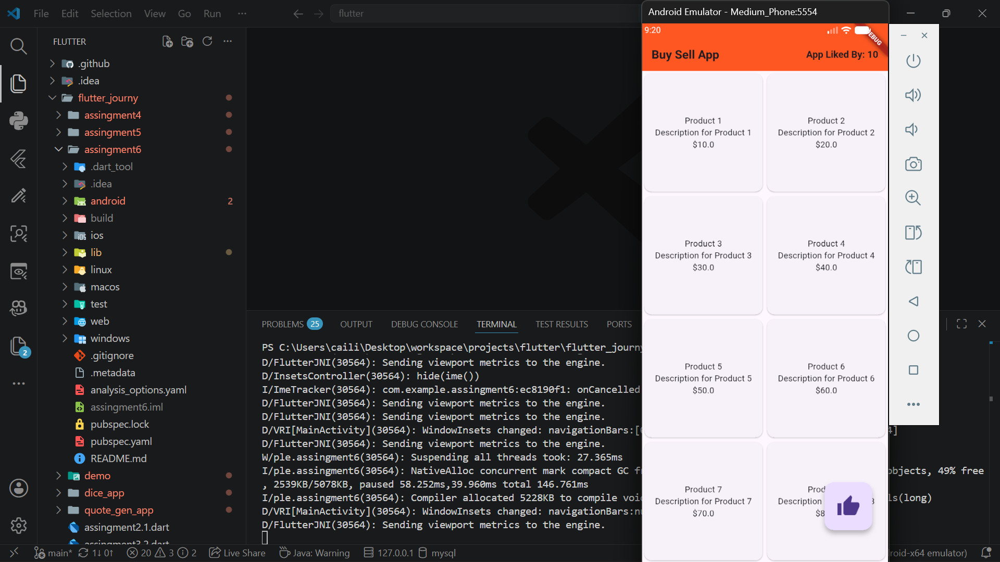
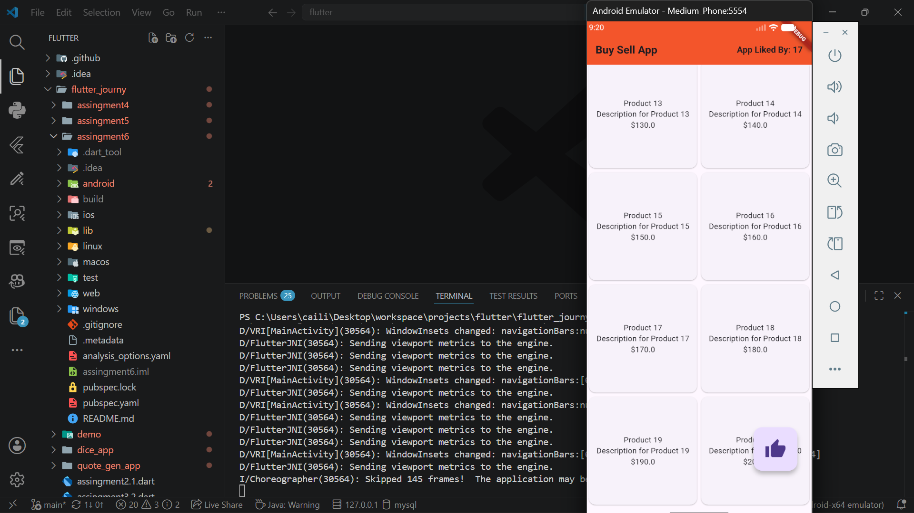

# Assingment6

## Extend Ul concepts using advanced widgets such as:
- ListView
- GridView
- Card
- ListTile

## Create a screen that displays data in:
- A scrollable list or
- A grid layout

## Add user interaction:
- Button clicks
- Item tap handling

### Apply proper spacing, alignment, and theming.

## Screenshots
### Interface
- Unscrolled

- Scrolled Down

### Button Working
- App Liked By Counter increases 

