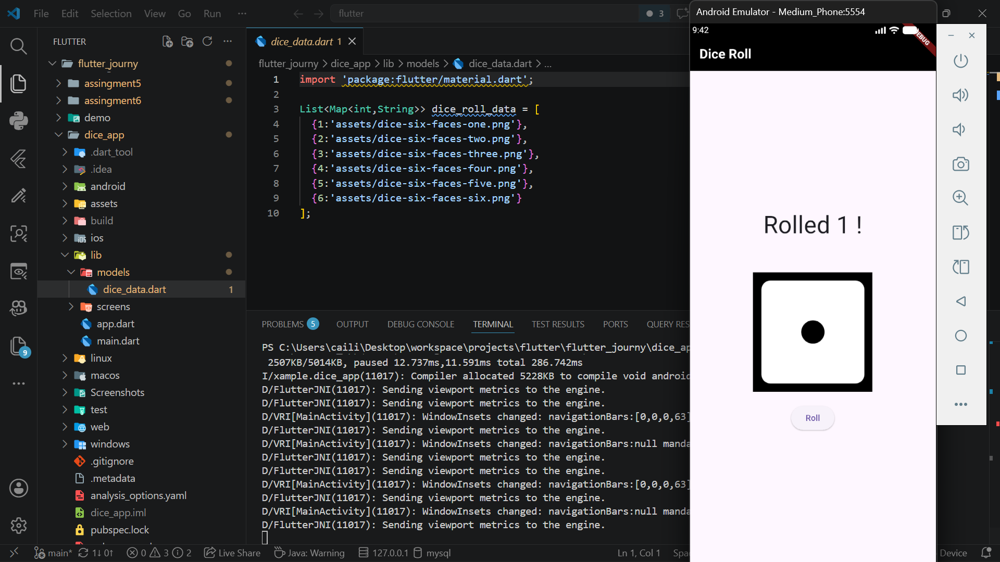
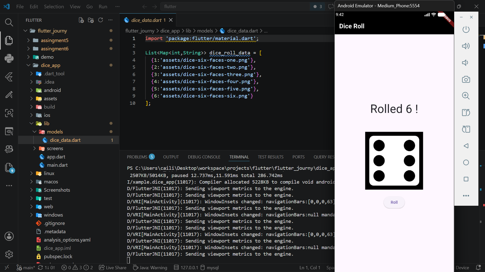

# Assingment 7 (Dice Roll)

## Create a Flutter app that displays:
- A dice image
- A button to roll the dice

## On button press:
- Generate a random number
- Change the dice image accordingly

## Use:
- StatefulWidget
- setState() for Ul updates

### Ensure the dice value changes every time the button is pressed.
### The app should run smoothly without crashes.

## Screenshots

