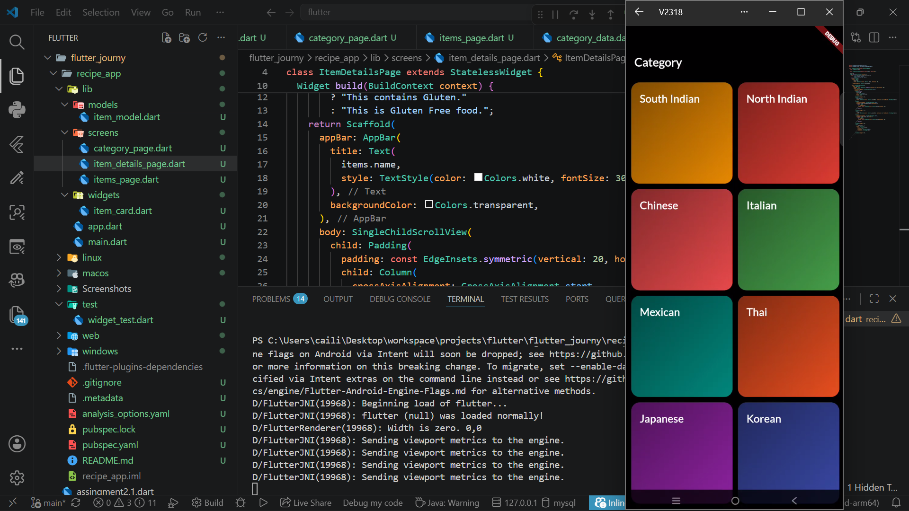
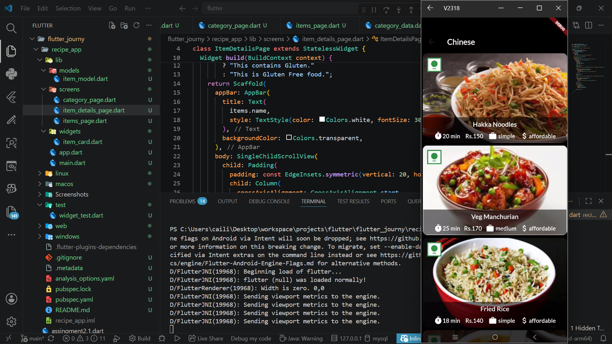
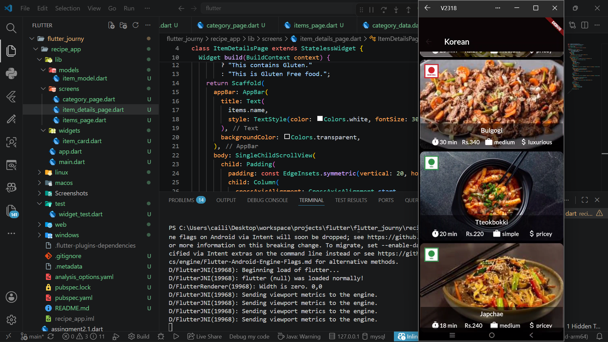
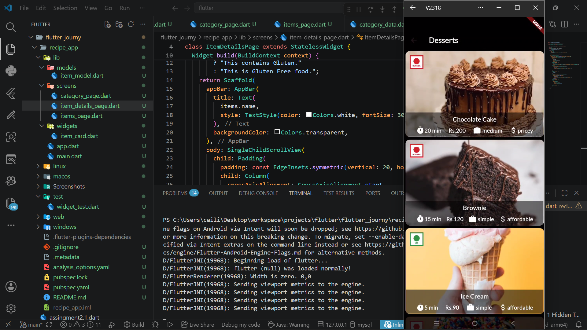
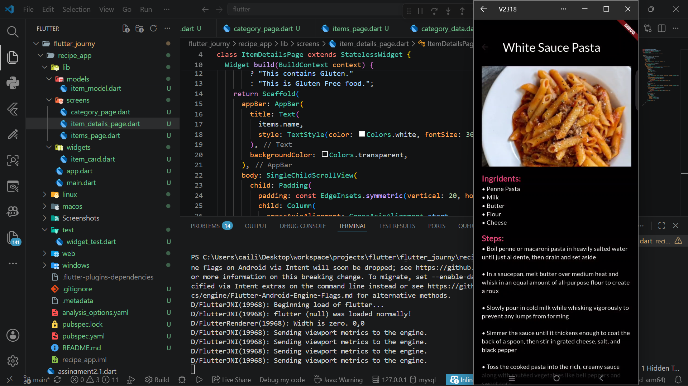
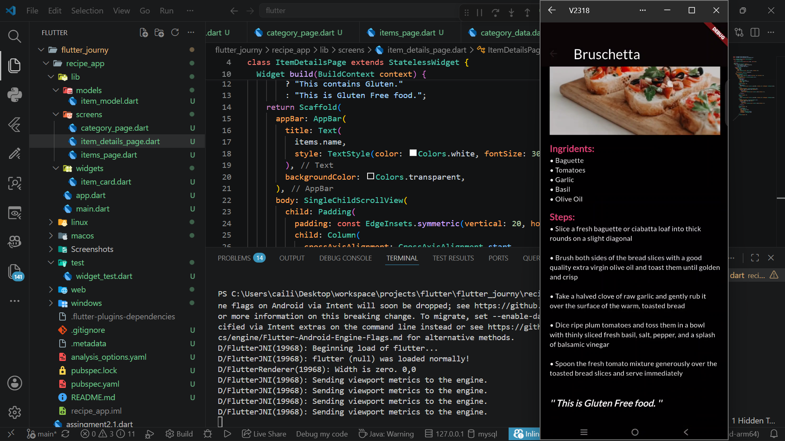
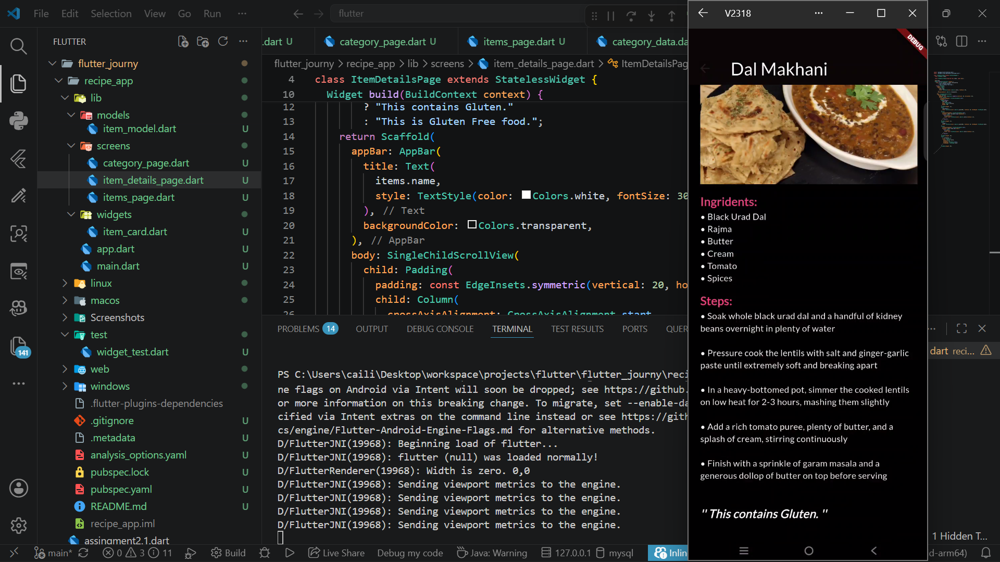

# recipe_app

## Create a Flutter application that provides help or instructions to users.
- The app should include:
- Multiple help/instruction screens or
- A list of topics with detailed instructions

## Use widgets such as:
- ListView
- ExpansionTile or
- Navigator for screen navigation

### Display clear and readable instructional text.

### Ensure smooth navigation between different help sections.

### The app should run without crashes or Ul overflow issues.

## Screenshots

### all the pages are scrollable

- main page

- menu page

- veg and non-veg indicators

- instructions page

- gluten free indicator

